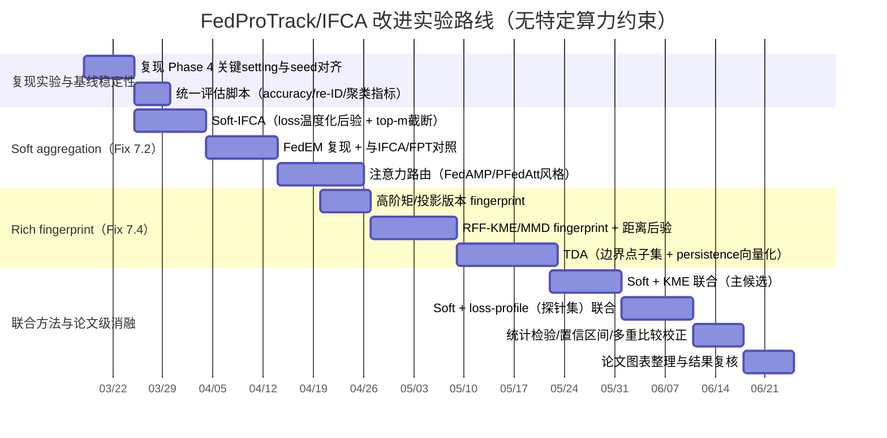

# 面向 SINE 决策边界差异的聚类联邦学习改进：IFCA 与 FedProTrack 的软聚合与 Fingerprint 表示路线深度调研报告

## 执行摘要

在以 **SINE** 这类“决策边界非线性、概念可复现/可翻转（label swap）”的合成任务为代表的场景中，**IFCA** 之所以往往更稳健，一个关键原因是它用“在每个簇模型上的损失（loss）”进行簇选择/分配，本质上直接对齐了“决策边界是否匹配”这一目标信号：若某个簇模型的边界更贴近当前客户端数据分布，该模型对该客户端样本的平均 loss 往往更低，因此更容易被选中。IFCA 的核心机制是“交替估计簇身份与优化簇模型参数”，并以 loss 驱动身份估计。citeturn0search0turn0search8

相比之下，**FedProTrack** 当前的 fingerprint 主要由“均值/协方差/标签分布”等低阶统计量构成（你的 Phase 4 报告中即以此指认其无法有效捕获非线性边界几何），在 SINE 这种“边界形状决定分类”的任务上，低阶统计常常不足以区分“分布相近但边界方向/曲率差异显著”的概念，从而在高速漂移（如 rho=2）下出现系统性落后。fileciteturn0file0 同一份报告还显示：FedProTrack 的 Phase 4 修复已经解决了多个“非 fingerprint 本体”的关键问题（概念-模型记忆缺失、初始化种子偏差、概念过度生成），使得整体 accuracy gap 大幅缩小并显著提升 re-ID，但在 SINE 高速漂移仍存在残余差距，后续正确的技术重点应回到 **(A) 软聚合/概率分配** 与 **(B) 更丰富的 fingerprint 表示** 两条主线。fileciteturn0file0

本报告给出一个可直接落地的研究路线：用 **后验概率加权（soft aggregation）** 将“硬分配错误”变成“可纠偏的软权重”，并将 fingerprint 从“低阶统计”升级为能表征边界几何的表示（例如：**loss profile/梯度 profile、核均值嵌入（KME/MMD+RFF）、拓扑描述符（持久同调）、学习到的集合/图嵌入（Deep Sets / GNN / 对比学习）**）。核嵌入与 MMD 能在 RKHS 中表达分布差异并支持近似计算；持久同调可从多尺度上编码嵌入点云的“孔/环”等拓扑结构；GNN/对比学习可在“客户端相似图”或“模型表征空间”中学习更强的区分性表示。citeturn2search1turn2search2turn7search0turn2search3turn6search3turn6search0turn2search12turn7search3

---

## 背景与问题重述

### SINE 任务为何对“边界几何”敏感

在联邦/分布式概念漂移文献中，SINE 常被定义为在单位方形内采样点，并以正弦曲线（如 \(x_2 < \sin(x_1)\)）作为决策边界；第二概念常可通过“翻转标签（swapping labels）”实现，从而产生明显的 **决策边界/概念切换**。citeturn1search1turn1search5  
对这类任务而言，“同一分布的一二阶矩”无法唯一决定分类边界；即便均值/协方差相近，边界的相位、曲率或 label swap 也可导致完全不同的最优分类器。这解释了为什么仅依赖低阶统计的 fingerprint 在 SINE 上会天然吃亏（你的内部实验亦呈现这一现象）。fileciteturn0file0

### IFCA 机制与其优势/局限

IFCA 的核心思路是在 clustered FL 中交替执行两步：  
1) **簇身份估计**：对每个客户端，用当前 \(K\) 个簇模型在其本地数据上计算 loss，选择 loss 最小的簇；  
2) **簇模型更新**：对每个簇聚合其成员客户端的更新（或梯度），更新该簇模型。citeturn0search0turn0search8  

这种“用 loss 直接驱动分配”的好处是：分配信号与最终任务目标一致（分类/回归损失），因此在“边界差异强”的任务（如 SINE）上更容易把客户端送到正确簇模型。然而 IFCA 也有典型局限：  
- **硬分配误差不可微/可纠偏性弱**：一旦早期误分配，可能导致簇模型更新方向被污染，甚至出现“错误自强化”。该类问题在聚类式 FL 中普遍存在。citeturn1search0turn1search4  
- **通信与存储开销随簇数 \(K\) 增长**：服务器需维护/下发多个簇模型（或其子集），客户端也需要在多个模型上评估 loss（至少是 forward 级别）。citeturn0search0turn0search8  

### FedProTrack 的现状：Phase 4 已修复的问题与仍未解决的“边界几何”瓶颈

你的 Phase 4 报告指出了三类会“掩盖/放大”FedProTrack 与 IFCA 差距的工程根因：  
- 概念复现时缺少“概念-模型记忆”（只记 fingerprint 不记模型参数）；  
- 初始化 seed 不一致造成系统性起点劣势；  
- novelty 阈值过敏导致概念过度生成、训练数据碎片化。fileciteturn0file0  

报告给出的修复（存模型、热启动策略、seed 对齐、阈值调整等）显著改善了总体表现，并将 accuracy gap 大幅缩小，同时 re-ID 大幅提升；但在 SINE 高速漂移（rho=2）仍存在残余落后，并将其归因到 fingerprint（均值/协方差/标签分布）难以捕获非线性决策边界几何。fileciteturn0file0  

因此，后续研究应把“方法论重心”从工程修 bug 转向两类结构性增强：  
- **Fix 7.2：Soft aggregation / 概率分配**（降低 hard assignment 的伤害并提供纠偏机制）；  
- **Fix 7.4：Richer fingerprint representations**（让相似性度量能“看见”非线性边界）。fileciteturn0file0  

---

## 候选改进路线一：软聚合与概率簇分配

软聚合的共同目标是把“客户端属于哪个簇”从离散的 \(\arg\min\) 选择，改成连续的后验权重 \(p(z=k\mid \cdot)\)，再用该权重进行模型聚合/模型选择/消息传递，从而实现：  
- **对误分配的鲁棒性**：错误不会以 100% 权重注入某一簇；  
- **可渐进纠偏**：随着证据累积，后验可从“混合”收敛到“尖峰”。  
这种思想在 mixture-of-distributions 的个性化联邦多任务学习中已有成熟范式（EM-like；学习 shared components + client mixture weights）。citeturn1search5turn1search9  

以下给出三类强候选方案，并按“与现有 IFCA/FedProTrack 改动的兼容性”组织。

### 基于损失的温度化后验：Soft-IFCA / Loss-Posterior Routing

**方法要点**  
将 IFCA 的硬选择 \(k^\*=\arg\min_k \mathcal{L}_k(D_i)\) 替换为温度化 softmax：  
\[
p_{ik}=\frac{\exp(-\mathcal{L}_k(D_i)/\tau)}{\sum_{k'}\exp(-\mathcal{L}_{k'}(D_i)/\tau)}
\]
用 \(p_{ik}\) 对簇模型更新做加权聚合，或对客户端接收的下行模型做加权融合（收到多个簇模型后在客户端线性/非线性融合）。该思想直接继承 IFCA 的“损失对齐决策边界”的优势。citeturn0search0turn0search8  

**预期收益**  
- 在 SINE 这类“模型边界匹配→loss 显著下降”的任务上，soft 后验能在概念切换/高速漂移时提供更平滑的路由过渡，减少误分配对单一簇的灾难性污染。citeturn1search1turn1search5  
- 与现有 IFCA 兼容度高：只需改簇选择与聚合权重；不必引入额外 encoder。citeturn0search0turn0search8  

**局限**  
- 仍需客户端/服务器获得每个 \(k\) 的 loss（至少 forward），当 \(K\) 较大时代价高。citeturn0search0turn0search8  
- \(\tau\) 选择敏感：过小→近似硬分配；过大→过度混合导致“簇模型不够专”。（这是设计与调参问题，需通过消融定位。）

**计算成本与数据需求**  
- 计算：每轮每客户端需评估 \(K\) 个模型的 loss（或至少对一小批 probe batch），成本约为 \(O(K \cdot \text{forward})\)。  
- 通信：若客户端需接收多个簇模型进行融合，下行通信上升；可用“top‑m 簇截断”（只下发后验最大的 m 个簇模型）控制成本。

**推荐评估指标**  
- Global/Per-client accuracy、概念切换后的恢复步数（time-to-recover）、簇分配熵 \(H(p_{i\cdot})\) 及其随时间的收敛曲线；在可得真簇标签的合成数据上报告 NMI/ARI/cluster purity。citeturn1search1turn1search5  

### 混合模型/EM 风格的 Soft Aggregation：FedEM / Mixture-of-Distributions 路线

**方法要点**  
把每个客户端分布视为若干共享成分分布的混合：客户端学习 mixture weights（软分配），服务器学习 components（簇模型）。FedEM 给出 EM-like 的训练框架与理论分析，并在个性化场景下相对多种基线取得更好效果。citeturn1search5turn1search9  

**预期收益**  
- 从概率建模角度更“自洽”：软分配不是启发式，而是通过（近似）极大似然/变分框架解释。citeturn1search5turn1search9  
- 在概念重叠或客户端数据为混合分布时（例如一个客户端包含多个概念子群），天然适配。citeturn1search5turn1search9  

**局限**  
- 实现复杂度高于 Soft-IFCA：需要更明确的 likelihood、E/M 步细节，且对 non-convex 深网设置的稳定性要额外验证。citeturn1search5turn1search9  
- 若真实分布不满足混合假设，软分配的解释性降低，但实践上仍可能有效（需要实验确认）。

**计算成本与数据需求**  
- 计算：相对 Soft-IFCA，可能减少“对所有簇评估 loss”的需要（取决于实现），但会增加 EM 迭代或 responsibilities 的更新。citeturn1search5turn1search9  
- 数据：无需额外共享数据，但可能需要更稳定的本地估计（小数据客户端上 responsibilities 易抖动）。

**推荐评估指标**  
- 除 accuracy 外，重点报告 mixture weights 的熵、簇模型间差异（参数距离/表示距离）、以及对未见客户端的泛化（FedEM 论文强调 fairness/泛化的改进方向之一）。citeturn1search5turn1search9  

### 注意力式聚合与个性化消息传递：FedAMP / PFedAtt 及其“软路由化”

**方法要点**  
以“客户端间相似性→注意力权重→更强协作”作为软聚合机制。FedAMP 提出 attentive message passing，使相似客户端对彼此贡献更大；PFedAtt 将注意力用于分组/协作并给出理论分析框架。citeturn1search10turn1search3  

**预期收益**  
- 不必显式维护离散簇（hard cluster）；可形成“软簇/连续社区结构”，在漂移连续变化时更平滑。citeturn1search10turn1search3  
- 更贴近 FedProTrack 的“相似性驱动 re-ID / 概念识别”思路：可把 fingerprint 相似度直接喂给 attention。  

**局限**  
- 相似性度量如果仍基于贫弱 fingerprint，则注意力也会“看不见非线性边界”；因此该路线强依赖 Fix 7.4 的表示增强。  
- 注意力矩阵构造可能带来 \(O(N^2)\) 的计算/通信压力（N=客户端数），通常需要近邻截断/采样。citeturn1search10turn1search3  

**计算成本与数据需求**  
- 计算：需要计算客户端嵌入或模型表征相似度并生成注意力权重。citeturn1search10turn1search3  
- 通信：若实现为“服务器向每客户端下发个性化加权模型”，下行可能增加；可用 top‑m 近邻限制。

**推荐评估指标**  
- 除准确率外，报告注意力权重的稀疏度、社区结构稳定性、以及“相似客户端协作强度 vs 性能”的相关性。citeturn1search10turn1search3  

---

## 候选改进路线二：更丰富的 Fingerprint 表示

你当前的关键痛点可以抽象为：  
> 现有 fingerprint 主要是（条件在类别上的）均值/协方差/标签边际分布等“低阶统计”，难以表达 **非线性决策边界** 的形状信息。fileciteturn0file0  

因此，目标是构造一种 fingerprint \(f_i\)，使得：  
- 若两个客户端属于同一概念/边界形状，则 \(d(f_i,f_j)\) 小；  
- 若属于不同概念（尤其是 SINE 的边界翻转/相位差），则 \(d(f_i,f_j)\) 大；  
- 并且该 fingerprint 可在不共享原始数据的前提下计算/传输（至少在仿真中可先不考虑隐私约束，但方法最好具备可扩展性）。

下面按“表达能力从弱到强、实现路径从简单到复杂”给出四类候选 fingerprint。

### 高阶统计与累积量：从二阶走向多阶（但要控制维度爆炸）

**方法要点**  
在现有均值/协方差基础上，引入：  
- 三阶/四阶中心矩、偏度/峰度（skewness/kurtosis）；  
- 类条件高阶矩（每类各自统计）以增强对类内几何的敏感性；  
- 或对特征做随机投影后再算高阶矩，以控制张量维度。  

**预期收益**  
- 实现成本低：不需要训练额外模型即可增强表征。  
- 在某些“非高斯、分布形状差异显著”的场景可提升区分度。

**局限**  
- 高阶矩对样本量非常敏感（小样本方差巨大），在客户端样本数较小时不稳定。  
- 高维特征下张量维度爆炸，必须做投影/压缩，否则通信不可接受。  

**计算成本与数据需求**  
- 计算：多阶统计本身 \(O(nd)\) 或 \(O(nd^2)\)（视实现）。  
- 数据：需要足够样本数稳定估计，尤其对三四阶。

**推荐评估指标**  
- fingerprint 的方差（跨随机种子/子采样稳定性）与聚类质量（NMI/ARI）随样本量变化的曲线。

### 核嵌入（KME）与 MMD：用 RKHS 表示分布，表达非线性差异

**方法要点**  
用核均值嵌入将分布映射到 RKHS：\(\mu_P=\mathbb{E}_{x\sim P}[\phi(x)]\)。KME 体系系统综述了其理论与应用；MMD 可作为分布间距离度量。citeturn2search0turn2search2  
工程上可用 **随机傅里叶特征（RFF）** 近似 shift-invariant kernels，把无穷维映射压到 \(D\) 维，从而让通信与计算可控。citeturn7search0  

**为何能“看见非线性边界”**  
如果你把输入特征（或中间层表征）看作分布，低阶矩只捕捉线性/二次结构；核嵌入通过非线性特征映射能把更复杂的形状差异拉开（尤其在合适的核与带宽下）。KME/MMD 是“分布上的学习/检验”的标准工具。citeturn2search0turn2search2  

**预期收益**  
- 表达能力显著强于均值/协方差；MMD 具有清晰统计意义（两样本检验框架）。citeturn2search2  
- 与 soft aggregation 兼容：可把“客户端-簇”的相似度定义为 KME 距离驱动的后验。citeturn2search0turn7search0  

**局限**  
- 核与带宽超参敏感；不同任务可能需要不同核。  
- 若直接用 MMD 二次时间复杂度，需近似（线性时间估计或 RFF）。citeturn2search6turn7search0  

**计算成本与数据需求**  
- 计算：RFF 版 KME 为 \(O(nD)\)；MMD 可在特征空间用均值差近似。citeturn7search0turn2search2  
- 通信：发送 \(D\) 维向量（每类一个则乘以 C）。典型 \(D=256\sim4096\) 可权衡。

**推荐评估指标**  
- fingerprint 可分性：同概念与异概念的距离分布（ROC/AUC）。  
- 聚类与路由性能：在 SINE 的概念翻转下，分配后验是否快速变尖锐。

### 拓扑描述符：持久同调捕捉“形状”而非“统计量”

**方法要点**  
在客户端本地，将样本的表示（可为输入、特征层 embedding、或“靠近边界的样本子集”）视作点云，计算持久同调（persistent homology）得到 persistence diagram，再做向量化（如 persistence image / landscape 等；这里给出方法层面建议，不限定具体向量化）。持久同调提供多尺度拓扑特征的稳定性结果与算法体系。citeturn2search3turn2search23  
工程实现可用 GUDHI 等官方库快速落地。citeturn6search3turn6search19  

**为何可能对 SINE 有效**  
SINE 的边界是曲线，概念翻转相当于“正负区域互换”。若你选取“高不确定度/高梯度”的样本子集（即靠近边界的点），其几何结构（连通性、环等）会随概念变化而变化；拓扑特征能在一定程度上对“曲线形状/连通结构”敏感，而不依赖线性统计假设。citeturn2search3turn6search3  

**预期收益**  
- 捕捉非线性几何/拓扑结构，特别适合“形状主导”的差异。citeturn2search3  
- 与 kernel 方案互补：KME 偏“分布差异”，TDA 偏“点云形状”。

**局限**  
- 计算开销可能较高，且对点云规模敏感（需要采样/稀疏化）。  
- 需要选择“在什么空间算拓扑”（输入空间 vs 表征空间）与“选哪些点”（全点 vs 边界点），这是一组新的关键设计超参。  

**计算成本与数据需求**  
- 计算：取决于复形构建（Rips/Alpha 等）与点数；通常需要下采样到几百点以内以可控。citeturn6search19turn6search3  
- 通信：发送向量化后的拓扑特征（例如 128–1024 维）。

**推荐评估指标**  
- “拓扑 fingerprint”对概念翻转的敏感性（概念 A/B 的分离度）。  
- 运行时开销（每轮/每客户端耗时）与可扩展性（客户端数、样本数）。

### 学得的 Fingerprint：集合编码（Deep Sets）/GNN/对比学习

这类方法的共同点是：把“客户端的样本集合/梯度集合/模型表征”作为输入，通过学习得到低维 embedding，用于聚类/路由/注意力权重计算。

**集合编码（Deep Sets）**  
Deep Sets 给出了置换不变函数的结构刻画与可复用架构：\(f(\{x_j\})=\rho(\sum_j \phi(x_j))\)。用它可把一个客户端的样本或表征集合编码为一个向量 fingerprint。citeturn7search3turn7search34  

**图嵌入（GAT / GraphSAGE）**  
当你能构造“客户端相似图”（例如以现有 fingerprint 距离建 kNN 图），再用 GAT 或 GraphSAGE 在图上学习节点（客户端）嵌入，使 embedding 同时利用局部邻域结构与节点特征。GAT/GraphSAGE是经典可扩展方案。citeturn6search0turn6search1  

**对比学习（SimCLR / MOON）**  
对比学习可用于学习“同概念更近、异概念更远”的表示；在联邦场景，MOON 将对比学习用在模型表征层以缓解异质性并提升性能。citeturn6search2turn2search12turn2search16  

**预期收益**  
- 表达力最强：可直接针对“概念可分性”端到端优化（例如监督信号来自 IFCA 的 loss 路由一致性、或合成数据的真概念标签）。  
- 可与 soft aggregation 深度耦合：输出不仅是 fingerprint，还可以直接输出后验 \(p(z=k\mid i)\)（门控网络/MoE 思路）。经典 MoE/专家混合提供门控学习范式。citeturn7search14turn7search2  

**局限**  
- 训练与调参复杂度显著提升；需要额外的验证与消融来证明提升来自“boundary-aware 表示”而非简单容量增加。  
- 可能需要某种监督/自监督信号（例如对比对的构造），否则 embedding 学习不稳定。citeturn6search2turn2search12  

**计算成本与数据需求**  
- 计算：需要额外 encoder 前向/反向；若是 GNN 还要图消息传递。citeturn6search0turn6search1  
- 数据：对比学习通常偏好更大 batch/更多训练步数；SimCLR 经验上对 batch size 敏感。citeturn6search2turn6search6  

**推荐评估指标**  
- fingerprint 可分性（AUC/聚类指标）+ 最终任务指标（accuracy、re-ID、漂移恢复速度）。  
- 表示质量诊断：t-SNE/UMAP 可视化、类内/类间距离比、对比损失收敛曲线。

---

## 候选改进路线三：混合方案与系统实现注意事项

软聚合与 richer fingerprint 并非二选一；在你的问题设定里，“两者叠加”往往是最合理的，因为：  
- soft aggregation 解决“硬选择造成的不可逆损伤”；  
- richer fingerprint 解决“相似性度量本身不够看见边界”的根因。fileciteturn0file0  

下面给出三种优先级最高、且最贴近你现有代码结构（已有 memory bank、posterior、re-ID 指标）的混合设计。

### 混合方案 A：Loss-augmented Fingerprint（把 IFCA 的优势注入 FedProTrack）

**核心思路**  
构造一个“loss profile fingerprint”：对一组固定的 probe inputs \(X_{\text{probe}}\)（可为服务器生成的合成点、或公共小数据集、或在 SINE 上直接用网格点），客户端返回：  
- 当前本地模型在 probe 上的 logits/概率分布摘要；或  
- per-probe loss 向量的低维投影（例如 PCA/RFF/随机投影后均值与分位数）；或  
- “边界不确定度”指标（例如熵/最大概率 margin 的统计）。  

这相当于把“决策边界行为”投影到一个共享输入集合上，使 fingerprint 直接编码边界几何的外显行为，而不是只看输入分布的低阶统计。

**收益/局限/成本**  
- 收益：非常直接地对齐“边界差异→loss/不确定度差异”，理论直觉与 IFCA 一致。citeturn0search0turn0search8  
- 局限：probe set 设计是关键超参；过小则信息不足，过大则通信与计算上升。  
- 成本：若 probe=1000 点、logits=2 类，只传标量统计则成本可控；若传全 logits 则较大（建议先做统计/压缩）。

### 混合方案 B：KME/MMD Fingerprint + Soft Posterior（概率簇分配的“可学习距离”版本）

**核心思路**  
用 RFF-KME 为每个客户端构造分布嵌入（可做类条件），服务器为每个簇维护“簇原型嵌入”（可为簇内均值），再用距离定义后验：  
\[
p_{ik}\propto \exp(-\|\mu_i-\bar{\mu}_k\|^2/\tau)
\]
然后用 \(p_{ik}\) 做软聚合。KME 与 MMD 的理论与实践基础成熟。citeturn2search0turn2search2turn7search0  

**收益/局限/成本**  
- 收益：比“均值/协方差”表达更强；实现比深度学习式 fingerprint 轻量。citeturn2search0turn7search0  
- 局限：核带宽与 RFF 维度要调；若特征维度变化大，需自适应带宽。  
- 成本：每客户端每轮 \(O(nD)\)，通信 \(O(D)\)（或 \(O(CD)\)）。

### 混合方案 C：GNN/Attention Routing（把“客户端-概念图”显式建模）

**核心思路**  
构建一个动态图：节点=客户端（或概念），边权=相似度（来自 richer fingerprint），在图上用 GAT/GraphSAGE 学到节点 embedding 或直接输出路由权重；再用这些权重做个性化聚合/软分配。citeturn6search0turn6search1turn1search10  

**收益/局限/成本**  
- 收益：能利用“群体结构/社区结构”，可能对 re-ID 与概念复现更有利（你的体系中 re-ID 是关键指标）。fileciteturn0file0  
- 局限：工程复杂度最高；需要图构建策略与稳定训练。  
- 成本：GNN 计算通常可控（稀疏图），但实现与调参成本显著上升。

### 实现注意事项：你体系中最应优先关注的工程点

结合你的 Phase 4 修复经验，后续新方法应显式规避三类“容易把方法论结论污染”的风险：  
- **初始化与随机性控制**：确保所有方法在相同 seed 策略下比较（你的报告已证明 seed 不一致会造成系统性起点差异）。fileciteturn0file0  
- **概念生命周期管理**：soft aggregation 会让“概念数量/簇数量”更难界定，务必设计 merge/shrink 与阈值自适应，否则仍会发生概念碎片化。fileciteturn0file0  
- **通信预算的可解释统计**：为每种 fingerprint 方案记录“每轮每客户端上行/下行字节数”，否则难以对方案做公平比较（LEAF 等基准强调系统指标的重要性）。citeturn3search3turn3search7  

---

## 实验设计、消融与统计检验

本节给出一套“可直接用于论文写作”的实验矩阵：先在 SINE 上验证“边界敏感性改进”是否成立，再扩展到常用 non-IID FL 基准，最后做系统消融与显著性检验。

### 数据集与任务设置

**优先合成漂移基准**  
- SINE、CIRCLE、SEA、MNIST 漂移：这些合成漂移数据集在联邦概念漂移研究中有明确生成定义与常用超参设置，可用于复现实验与控变量分析。citeturn1search1turn1search5  
  - 其中 SINE 的关键在“正弦边界 + 概念翻转”。citeturn1search5  

**常用联邦 non-IID/个性化基准（建议二阶段扩展）**  
- LEAF 套件（FEMNIST、Shakespeare、Sent140 等）作为标准联邦基准，可用于验证方法在真实 federated 划分下的泛化。citeturn3search3turn3search7  
- 视觉分类可用 CIFAR-10/100 的 Dirichlet label skew（作为补充）；并引入特征偏移场景可以对照 FedBN 等方法的处理范式。citeturn5search3turn5search27  

### 基线方法（必须包含）

为保证论文可比性，建议基线分三层：

**层 1：通用联邦优化基线**  
- FedAvg（经典基线）。citeturn3search0turn3search4  
- FedProx（异质性下稳健优化）。citeturn3search1turn3search5  
- SCAFFOLD（控制变量减少 client drift）。citeturn3search2turn3search6  

**层 2：聚类/多模型基线**  
- IFCA（硬簇选择的代表）。citeturn0search0turn0search8  
- CFL（后处理聚类/多任务式聚类联邦学习）。citeturn1search0turn1search8  

**层 3：软聚合/注意力/混合分布基线**  
- FedEM（EM-like mixture-of-distributions）。citeturn1search5turn1search9  
- FedAMP / PFedAtt（注意力式个性化协作）。citeturn1search10turn1search3  

**你的主对照组**  
- FedProTrack-default、FedProTrack-fix（作为当前最强内部实现），以及 IFCA（你的报告已给出它们在 Phase 4 的对照）。fileciteturn0file0  

### 候选方法的实验矩阵与关键超参范围

为了让实验“可控且能定位改进来源”，建议按以下方式分组：

**组 A：只改分配（soft aggregation），不改 fingerprint**  
- Soft-IFCA：\(\tau \in \{0.1,0.3,1.0,3.0\}\)，top‑m 截断 \(m\in\{1,2,4\}\)。  
- FedEM：components 数 \(M\in\{2,3,5,8\}\)，本地 EM 步数 \(E\_M\in\{1,3\}\)。citeturn1search5turn1search9  
- 评价目标：证明“soft assignment 能在 rho=2 下减少崩溃/抖动”。

**组 B：只改 fingerprint，不改聚合（仍 hard assignment）**  
- Higher-order moments：阶数 \(p\in\{3,4\}\)，随机投影维度 \(D\in\{64,256,1024\}\)。  
- RFF-KME：核带宽（用 median heuristic 起步）× RFF 维度 \(D\in\{256,1024,4096\}\)。citeturn7search0turn2search0  
- TDA：点云采样点数 \(n\in\{100,300,500\}\)，复形类型（Rips 为主），向量化维度 \(V\in\{128,512\}\)。citeturn6search19turn2search3  
- 评价目标：证明“fingerprint 可分性上升”能转化为“concept re-ID 与 accuracy 上升”。

**组 C：联合改进（推荐作为最终主方法）**  
- (B 的 fingerprint) + (A 的 soft posterior)。  
- 若引入学习到的 embedding：  
  - Deep Sets encoder 维度 \(h\in\{128,256\}\)；  
  - GAT 层数 \(L\in\{2,3\}\)、邻居数 \(k\in\{10,20\}\)。citeturn7search3turn6search0  
  - 对比学习温度/队列：参考 SimCLR/MOON 的温度范围（例如 0.1–0.5），并做消融。citeturn6search2turn2search12  

### 统计检验与报告规范

在你已采用“多 settings × 多 seeds”的评估范式基础上，建议把统计检验做成论文级标准：

1) **配对比较**：同一 setting、同一 seed 下方法 A vs B 的差值，使用配对 t-test 或 Wilcoxon signed-rank test（更稳健）。  
2) **多重比较校正**：当方法/数据集较多时，用 Holm–Bonferroni 控制 family-wise error。  
3) **置信区间**：对“settings 维度”做 bootstrap（重采样 settings）给出 95% CI，避免只报均值。  
4) **漂移场景专用指标**：报告“切换后第 \(t\) 步 accuracy 恢复到稳态的 90% 所需步数”，并对该步数做统计检验（更能体现软聚合优势）。citeturn1search1turn1search5  

---

## 对比表格、时间线与可视化/实现要点

### 方法对比表：软聚合候选

| 方法族 | 代表实现/参考 | 核心思想 | 预期收益 | 主要局限 | 计算/通信代价（定性） | 对数据量敏感性 | 关键评估指标 |
|---|---|---|---|---|---|---|---|
| Loss‑posterior（Soft‑IFCA） | IFCA 的温度化后验变体citeturn0search0turn0search8 | 用 \(\exp(-loss/\tau)\) 得到软分配并加权聚合 | 保留 IFCA 的“边界对齐”优势，降低硬误分配损伤 | 仍需多模型 loss 评估，\(\tau\) 需调 | 计算↑（随K线性），通信可用 top‑m 控制 | 中 | Accuracy、恢复步数、分配熵 |
| EM/混合分布（FedEM） | FedEM + 官方仓库citeturn1search5turn1search9 | 客户端分布为混合，学习 components + mixture weights | 概率建模自洽，适配混合概念客户端 | 实现更复杂；深网下需验证稳定性 | 中‑高 | 中 | Accuracy、公平性、mixture weights 稳定性 |
| 注意力/消息传递（FedAMP / PFedAtt） | FedAMP、PFedAttciteturn1search10turn1search3 | 相似客户端更强协作，形成软社区 | 免显式簇；漂移更平滑，适配 re-ID | 相似度若弱则无效；可能有 \(O(N^2)\) 压力 | 中‑高（需稀疏化） | 中 | Accuracy、权重稀疏度、社区稳定性 |

### 方法对比表：Fingerprint 增强候选

| Fingerprint | 参考/理论依据 | 能捕捉的差异类型 | 预期收益 | 局限 | 计算/通信代价（定性） | 数据需求 | 推荐搭配 |
|---|---|---|---|---|---|---|---|
| 高阶矩/累积量 | 统计增强（通用） | 分布形状（非高斯性） | 快速增强、好实现 | 小样本不稳；高维爆炸 | 低‑中 | 较高 | Soft‑IFCA（低成本试水） |
| KME/MMD + RFF | KME综述、MMD、RFFciteturn2search0turn2search2turn7search0 | 非线性分布差异（核诱导） | 表达强、可近似可控 | 选核/带宽敏感 | 中 | 中 | FedEM / 注意力 / posterior routing |
| 持久同调（TDA） | Edelsbrunner/Harer + GUDHIciteturn2search3turn6search19 | 点云形状/拓扑结构 | 对几何形状敏感，补足统计不足 | 计算重、设计超参多 | 中‑高 | 中 | 作为“边界点子集”专用增强 |
| 学得嵌入（Deep Sets/GNN/对比学习） | Deep Sets、GAT、SimCLR、MOONciteturn7search3turn6search0turn6search2turn2search12 | 由数据驱动自动学习差异 | 表达力最强，可端到端 | 训练复杂、需消融证明有效性 | 高 | 中‑高 | 与 soft aggregation 联合做主方法 |

### Mermaid 实验时间线（建议按周推进）

### 建议可视化（用于论文与诊断）

为确保“改进确实来自边界几何被捕捉”，建议固定输出以下图组：

1) **SINE 决策边界图**：在 2D 网格上画出不同簇模型/路由后的最终模型的预测区域与边界线；对比 IFCA（硬）vs Soft‑IFCA vs FedProTrack(+新 fingerprint)。SINE 边界定义与概念翻转可直接引用漂移数据集定义。citeturn1search5  
2) **Fingerprint 几何图**：对客户端 fingerprint 做 UMAP/t‑SNE，颜色标注真概念（合成数据可得）或时间段；同时画出簇中心/概念原型轨迹。  
3) **后验时间序列图**：对若干代表客户端画 \(p_{ik}(t)\) 随时间变化，观察漂移发生时后验是否平滑迁移、是否出现“概念碎片化”的多峰现象。  
4) **距离分布/可分性图**：同概念 vs 异概念的 fingerprint 距离直方图与 ROC/AUC（直接衡量 Fix 7.4 是否成功）。  
5) **成本-性能散点图**：横轴通信字节/轮，纵轴 accuracy 或恢复步数，展示性价比；LEAF 强调系统维度的评估观念可作为写作依据之一。citeturn3search3turn3search7  

### 代码与实现要点（可直接落地的“接口级”建议）

以下以“你已有 memory bank + posterior 体系”为假设（Phase 4 已引入概念-模型存储等机制），给出实现层面的关键改动点（接口/模块级，不依赖具体框架）：

**Soft aggregation 插入点**  
- 将“概念分配”从 `concept_id = argmin(...)` 改为返回 `p_over_concepts`（长度 K 的概率向量），并把  
  - server 聚合：`agg_k = Σ_i p_{ik} * update_i`  
  - client 下发：可下发 top‑m 概念模型并在客户端做 `model = Σ_k p_{ik} * model_k`（或只用作选择/初始化）。  
- 关键工程策略：top‑m 截断 + 概率重新归一化，避免下行爆炸。

**RFF-KME Fingerprint 插入点**  
- 在客户端本地对特征 \(h(x)\)（建议取倒数第二层 embedding，而非输入）计算 RFF：\(z(x)\in\mathbb{R}^D\)。citeturn7search0  
- fingerprint 取 \(\mu_i=\frac{1}{n}\sum_j z(x_j)\)，类条件版本为 \(\mu_{i,c}\)。  
- server 端维护每概念原型 \(\bar{\mu}_k\)，并输出距离驱动后验。

**TDA Fingerprint 插入点**  
- 先定义“边界点”采样策略（例如取预测熵最高的 top‑q% 样本或 margin 最小样本），再在这些点的 embedding 上构建 Rips complex 并计算 persistence；用 GUDHI 工具链快速实现。citeturn6search19turn6search3  
- 先做小规模消融：只在 SINE 上验证是否能区分概念翻转，再决定是否推广到真实数据集。

**学习到的 Fingerprint（Deep Sets / 对比学习 / GNN）**  
- Deep Sets：把客户端小批量 embedding 作为集合输入，输出 client embedding；理论上具备置换不变性。citeturn7search3  
- 对比学习：用“同一概念不同时间片/不同客户端”为正对，随机其他概念为负对；SimCLR 的温度与投影头经验可迁移。citeturn6search2  
- GNN：先用现有 fingerprint 构图（kNN），再用 GAT/GraphSAGE 学 client embedding；GAT/GraphSAGE 是成熟主干。citeturn6search0turn6search1  

---

## 优先参考文献与官方实现

以下按“与你问题最直接相关 → 方法论支撑 → 工程实现工具”的优先级排序（中英混排，尽量采用原始/官方来源；条目后均给出可点击来源）：

- IFCA：An Efficient Framework for Clustered Federated Learning（含 IFCA 算法细节与实验）。citeturn0search0turn0search8  
- SINE 等合成漂移数据集定义（包含 SINE 的正弦边界与概念翻转描述）。citeturn1search5turn1search1  
- CFL：Clustered Federated Learning（论文与官方仓库）。citeturn1search0turn1search8  
- FedEM：Federated Multi-Task Learning under a Mixture of Distributions（论文与官方仓库）。citeturn1search5turn1search9  
- FedAMP：Personalized Federated Learning: An Attentive Collaboration Approach（注意力消息传递个性化 FL）。citeturn1search10turn1search18  
- PFedAtt：Attention-based Personalized Federated Learning（注意力分组/协作框架）。citeturn1search3  
- MOON：Model-Contrastive Federated Learning（联邦场景对比学习；含官方仓库）。citeturn2search12turn2search16  
- KME 综述：Kernel Mean Embedding of Distributions（分布嵌入体系）。citeturn2search0turn2search1  
- MMD：A Kernel Two-Sample Test（MMD 的经典来源）。citeturn2search2turn2search6  
- RFF：Random Features for Large-Scale Kernel Machines（核近似关键工具）。citeturn7search0turn7search4  
- 持久同调基础与稳定性：Persistent Homology—A Survey；Stability of Persistence Diagrams。citeturn2search3turn2search23  
- GUDHI（持久同调/拓扑数据分析官方文档）。citeturn6search19turn6search3  
- GAT / GraphSAGE（学习图嵌入的经典主干）。citeturn6search0turn6search1  
- Deep Sets（集合输入的置换不变表示学习）。citeturn7search3turn7search34  
- FedAvg（联邦学习经典基线）。citeturn3search0turn3search4  
- FedProx（异质性下稳健优化基线）。citeturn3search1turn3search5  
- SCAFFOLD（控制变量校正 client drift）。citeturn3search2turn3search6  
- LEAF（联邦基准套件，含系统评估维度）。citeturn3search3turn3search7  
- 中文综述（用于中文论文写作背景段落，可择优引用）：联邦学习综述（2025）。citeturn4search0  
- 个性化联邦学习综述（PFL taxonomy，可用于 related work 结构化写作）：Towards Personalized Federated Learning。citeturn5search1turn5search5  
- 聚类式联邦学习综述（CFL 方向梳理，可用于 related work）：A Survey on Cluster-based Federated Learning（2025）。citeturn5search6  

（补充说明：本报告中关于你当前 FedProTrack 体系的 Phase 4 现象、根因、修复与残余弱点来自你上传的改进报告。fileciteturn0file0）